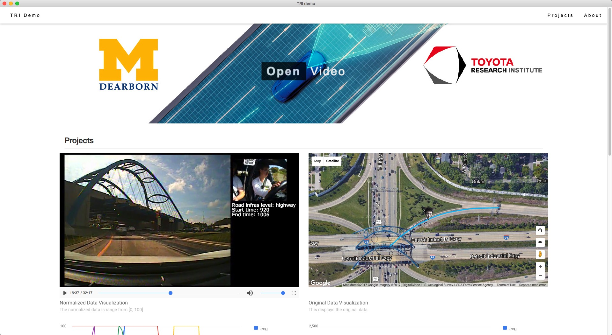
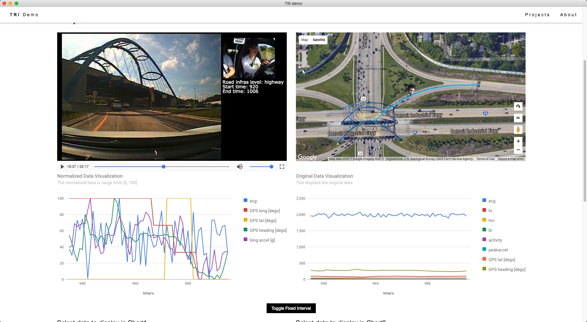
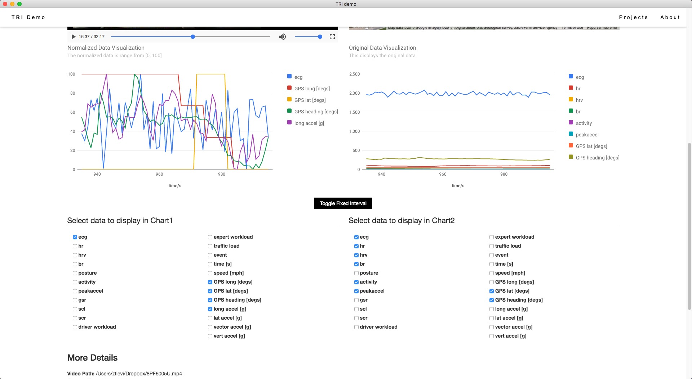

# Demo Program for Toyota Research Institute
## Install

Download the binary demo program below:

https://github.com/ztlevi/TRI_demo/releases

## Screenshot

There is a demo video recorded can be viewed [here](https://youtu.be/uuWda2Rw0P4)

 

 

 

## Features
- Real-time driving information monitoring (displayed on Google Map, video, and More detail section)
- Data visualization
- Signal selection
- Cross platform

## Built on
- [Electron](https://electron.atom.io/): Build cross platform desktop apps with JavaScript, HTML, and CSS

## License
All rights reversed under Intelligent System Lab in UM-Dearborn and Toyota Research Institute.
