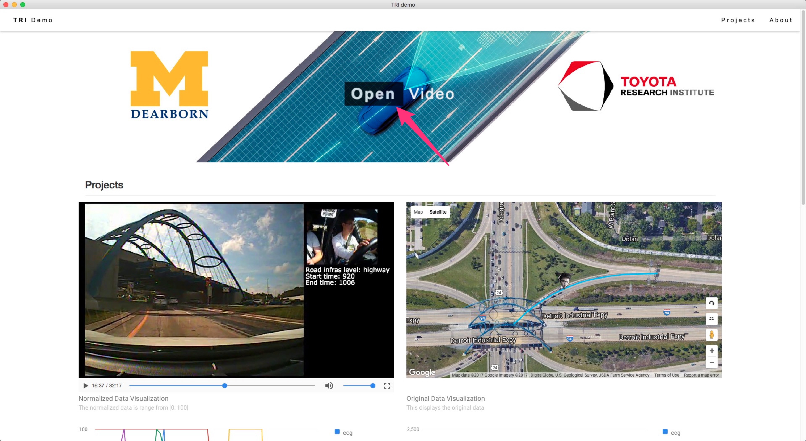
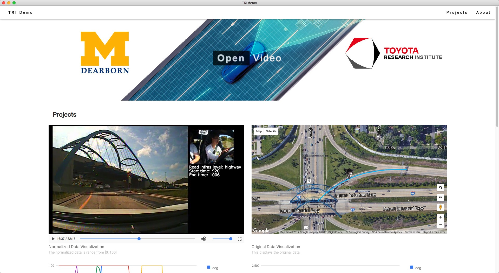
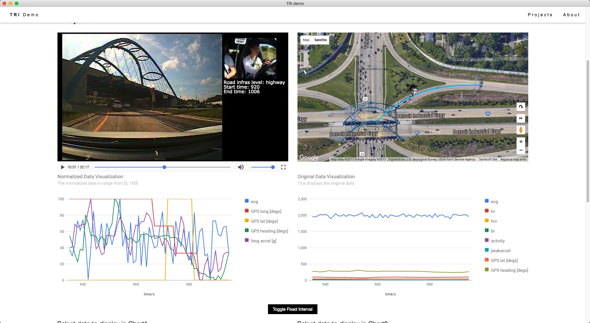
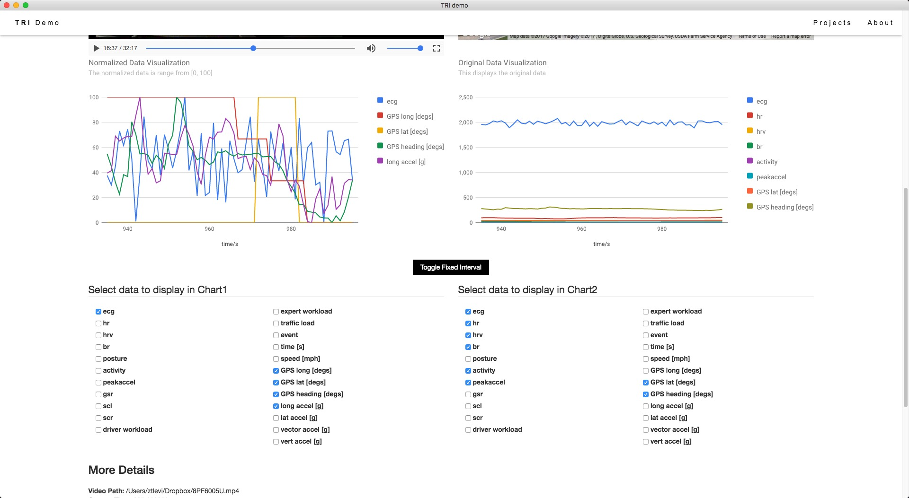

# Demo Program for TRI Porject (funded by Toyota Research Institute)

## Install

1. Download the binary [release](https://github.com/ztlevi/TRI_demo/releases).
2. Download the video file from my Google Drive: [video](https://drive.google.com/file/d/0B4D00TEC3VOUdVpqMFJtUE1oMVk/view?usp=sharing)

## Run

1. Unzip and run the executable file.

   - Windows: TRI_demo.exe
   - MacOS X: TRI_demo.app

2. Click the "Open Video" button in the middle and locate the video file.

   

## Screenshot

1. Demo video on Youtube

   There is a demo video recorded can be viewed [here](https://youtu.be/uuWda2Rw0P4)

2. Video canvas and Google Map view

   

3. Signal Line Charts

   

   You can click the coordinate points in charts to trace back to the time of coordinate points.

4. Signal Selections

   

## Features

- Real-time driving information monitoring (displayed on Google Map, video, and More detail section)
- Data visualization
- Signal selection
- Cross platform

## Built on

- [Electron](https://electron.atom.io/): Build cross platform desktop apps with JavaScript, HTML, and CSS

- Google Map API

- Google Visualization API

## License

All rights reversed under Intelligent System Lab in UM-Dearborn and Toyota Research Institute.
